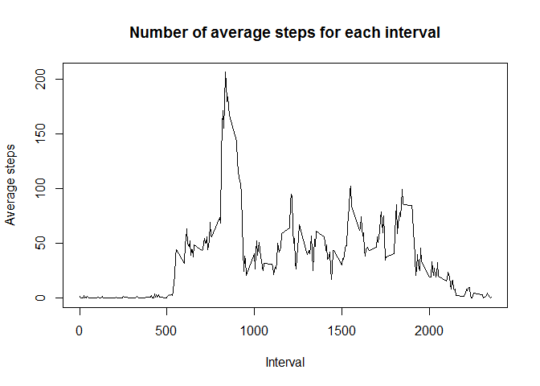
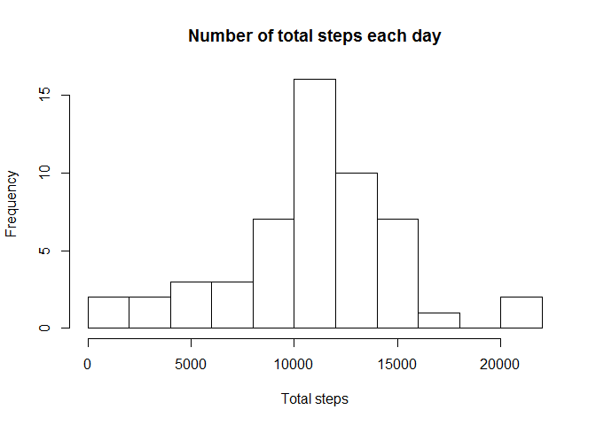
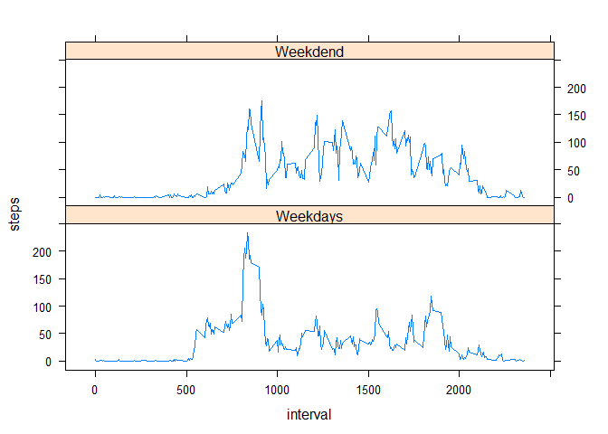

# Reproducible Research: Peer Assessment 1


## Loading and preprocessing the data

```r
dat <- read.csv("activity.csv")
head(dat)
```

```
##   steps       date interval
## 1    NA 2012-10-01        0
## 2    NA 2012-10-01        5
## 3    NA 2012-10-01       10
## 4    NA 2012-10-01       15
## 5    NA 2012-10-01       20
## 6    NA 2012-10-01       25
```

Here we remove the NAs and store the new data in 'dat2'.


```r
dat2 <- dat[!is.na(dat$steps),]
head(dat2)
```

```
##     steps       date interval
## 289     0 2012-10-02        0
## 290     0 2012-10-02        5
## 291     0 2012-10-02       10
## 292     0 2012-10-02       15
## 293     0 2012-10-02       20
## 294     0 2012-10-02       25
```


## What is mean total number of steps taken per day?

```r
total_steps <- aggregate(steps~date, data = dat2, sum)
hist(total_steps$steps, breaks = 12, main = "Number of total steps each day", xlab = "Total steps")
```

<!-- -->

The mean total number of steps each day is:

```r
mean(total_steps$steps)
```

```
## [1] 10766.19
```

The median total number of steps each day is:

```r
median(total_steps$steps)
```

```
## [1] 10765
```

## What is the average daily activity pattern?

```r
average_steps <- aggregate(steps~interval, data = dat2, mean)
head(average_steps)
```

```
##   interval     steps
## 1        0 1.7169811
## 2        5 0.3396226
## 3       10 0.1320755
## 4       15 0.1509434
## 5       20 0.0754717
## 6       25 2.0943396
```

Here we look at on average which interval has the maximum number of steps.

```r
average_steps$interval[which.max(average_steps$steps)]
```

```
## [1] 835
```

The pattern can be shown as:

```r
plot(average_steps$interval, average_steps$steps, type = "l", main = "Number of average steps for each interval", xlab = "Interval", ylab = "Average steps")
```

<!-- -->

From this we can clearly see the spike between 500 and 1000.

## Imputing missing values
Now we calculate the number of NAs in the original data.


```r
sum(is.na(dat$steps))
```

```
## [1] 2304
```
So there are 2304 rows that have NA values.
To eliminate those NA values, we take the average value of the corresponding interval and replace the NA with it. We store the new data into dat3.


```r
dat3 <- dat
dat3 <- merge(x = dat, y = average_steps, by = "interval",  all = TRUE, sort = FALSE)
NA_index = is.na(dat3$steps.x)
dat3$steps.x[NA_index] <- dat3$steps.y[NA_index]
dat3 <- dat3[order(dat3$date, dat3$interval),]
head(dat3)
```

```
##     interval   steps.x       date   steps.y
## 1          0 1.7169811 2012-10-01 1.7169811
## 63         5 0.3396226 2012-10-01 0.3396226
## 128       10 0.1320755 2012-10-01 0.1320755
## 205       15 0.1509434 2012-10-01 0.1509434
## 264       20 0.0754717 2012-10-01 0.0754717
## 327       25 2.0943396 2012-10-01 2.0943396
```

To see the impact of this operation on the total number of steps per day, we calculate the mean and median again.

```r
total_steps.x <- aggregate(steps.x~date, data = dat3, sum)
hist(total_steps$steps, breaks = 12, main = "Number of total steps each day", xlab = "Total steps")
```

<!-- -->

The mean total number of steps each day is:

```r
mean(total_steps.x$steps.x)
```

```
## [1] 10766.19
```

The median total number of steps each day is:

```r
median(total_steps.x$steps.x)
```

```
## [1] 10766.19
```

We can see the change is not so much from previous estimate.

## Are there differences in activity patterns between weekdays and weekends?

```r
weekend <- grepl("Sunday|Saturday" ,weekdays(as.Date(dat2$date)))
dat2$day <- "Weekdays"
dat2$day[weekend] <- "Weekend"
dat2$day <- as.factor(dat2$day)
```

Now let draw the patterns for weekdays and weekend respectively. We use xyplot to do the job.

```r
dat2_weekdays <- subset(dat2, day == "Weekdays")
dat2_weekend <- subset(dat2, day == "Weekend")

average_steps_weekdays <- aggregate(steps~interval, data = dat2_weekdays, mean)
average_steps_weekdays$day <- "Weekdays"

average_steps_weekend <- aggregate(steps~interval, data = dat2_weekend, mean)
average_steps_weekend$day <- "Weekdend"

average_steps <- rbind(average_steps_weekend,average_steps_weekdays)
average_steps$day <- as.factor(average_steps$day)

library(lattice)
with(average_steps, xyplot(steps ~ interval | day, type = "l", layout = c(1, 2)))
```

<!-- -->


